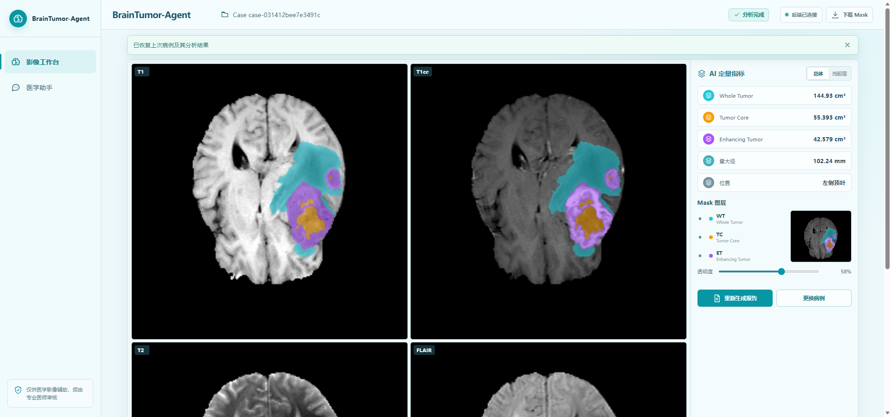
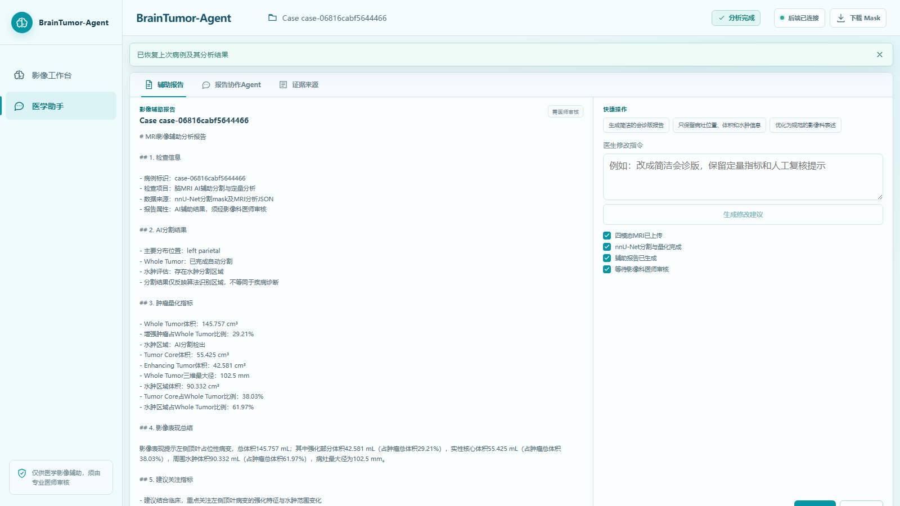

# BrainTumor-Agent

基于多模态MRI、nnU-Net、医学知识库RAG和Qwen-plus的脑肿瘤智能辅助分析项目。

当前版本已实现BraTS 2021四模态数据处理与阅片、nnU-Net V2训练/推理/评估、
分割定量分析、Qwen-plus辅助报告与医生确认式编辑、多语言Embedding + FAISS医学
知识库，以及由LangGraph编排的MRI Assistant Agent。FastAPI与React已接通上传、
异步分析、任务恢复、进度/取消、病例恢复、报告、问答和证据引用的完整流程。

> 本项目当前仅用于科研和教学，不作为独立临床诊断依据。

## 界面预览

| 影像工作台 | 医学助手 |
| --- | --- |
|  |  |

演示操作见[`docs/DEMO_GUIDE.md`](docs/DEMO_GUIDE.md)，系统设计见
[`docs/ARCHITECTURE.md`](docs/ARCHITECTURE.md)。

## 项目结构

- `data_process/`：BraTS四模态发现、NIfTI读取、几何检查、低内存归一化和processed数据保存。
- `segmentation/`：nnU-Net推理服务接口与结果契约。
- `feature_extract/`：体积、位置、形态等确定性特征接口。
- `longitudinal/`：多时相病例定量变化、检查间隔和对比结果持久化。
- `rag/`：医学知识入库、FAISS索引和检索接口。
- `agent/`：LangGraph状态、工具白名单和工作流入口。
- `backend/`：FastAPI应用、API路由和后端测试。
- `frontend/`：React + Vite医生端基础页面。
- `configs/`：非敏感应用、分割、RAG和日志配置。
- `models/`：模型说明；权重文件不进入Git。
- `runtime/`：本地数据、索引和运行产物，首次运行时创建且不进入Git。

## 环境要求

推荐环境：

- Ubuntu 22.04/24.04或Windows 11 + WSL2。
- Python 3.11。
- Node.js 20或更高版本。
- NVIDIA GPU与项目所选PyTorch版本兼容的CUDA驱动。
- Redis和PostgreSQL；只运行当前健康检查时可以暂不启动。

在Windows原生环境中，FAISS和部分医学影像依赖可能缺少合适的预编译包。计划进行nnU-Net训练或GPU推理时，优先使用WSL2、Linux服务器或容器环境。

## Python环境

在项目根目录创建并激活虚拟环境：

1. 创建环境：`python -m venv .venv`
2. PowerShell激活：`.venv\Scripts\Activate.ps1`
3. Linux/WSL激活：`source .venv/bin/activate`
4. 升级安装工具：`python -m pip install --upgrade pip`
5. 根据目标CUDA版本安装官方PyTorch构建。
6. 安装其余依赖：`pip install -r requirements.txt`

复制环境变量模板：

- PowerShell：`Copy-Item .env.example .env`
- Linux/WSL：`cp .env.example .env`

不要将真实的`DASHSCOPE_API_KEY`或患者信息提交到版本库。

## 一键启动（推荐）

在项目根目录运行：

1. 启动全部服务：`.\scripts\start_all.ps1`
2. 停止全部服务：`.\scripts\stop_all.ps1`

Windows日常使用无需输入命令：打开项目根目录的`启停/`文件夹，双击`一键启动.cmd`
或`一键停止.cmd`即可。`scripts/`中的PowerShell文件是内部实现，不需要逐个运行。

启动脚本优先使用本机`redis-server`或Memurai，随后启动FastAPI、单并发Celery Worker
和前端，等待健康检查通过后打开浏览器。日志与进程状态保存在系统临时目录的
`BrainTumor-Agent/`中，重复运行不会重复启动服务。只有找不到本机Redis兼容服务端时，
脚本才会回退到Docker Redis。也可通过`BTA_REDIS_SERVER`指定服务端可执行文件的完整路径。

## 启动后端

在项目根目录运行：

PowerShell中建议显式使用项目虚拟环境，避免误调用系统Python：

`.venv\Scripts\python.exe -m uvicorn backend.app.main:app --reload --host 0.0.0.0 --port 8000`

也可以直接运行`.\scripts\start_backend.ps1`。

MRI分析使用Redis和单并发Celery Worker。启动Redis后另开终端运行
`.\scripts\start_worker.ps1`。API提交分析后立即返回`task_id`，任务状态持久化在
数据目录的`analysis_tasks/`下，刷新页面可恢复进度。取消请求在安全阶段边界生效；
正在执行的nnU-Net子进程不会被强制终止。

健康检查地址：

- `http://localhost:8000/api/v1/health`
- OpenAPI文档：`http://localhost:8000/docs`

后端已提供四模态上传、完整MRI分析、辅助报告和Agent问答接口：

- `POST /api/v1/upload`
- `POST /api/v1/analyze`
- `GET /api/v1/analysis-tasks/{task_id}`
- `POST /api/v1/analysis-tasks/{task_id}/cancel`
- `GET /api/v1/cases?analyzed_only=true`
- `POST /api/v1/comparisons`
- `GET /api/v1/comparisons/{comparison_id}`
- `POST /api/v1/report`
- `POST /api/v1/chat`

分析提交响应包含任务编号；成功后病例恢复接口包含BraTS标签mask下载地址与完整肿瘤
量化指标。接口输入、配置和调用示例见
`backend/README.md`。

## 启动前端

进入`frontend`目录后运行：

1. `npm install`
2. `npm run dev`

也可以在项目根目录直接运行`.\scripts\start_frontend.ps1`。

默认访问地址为`http://localhost:5173`。

医生端界面已实现四模态NIfTI浏览器解析、四窗口切片、BraTS mask叠加、WT/TC/ET
图层控制、量化指标、辅助报告、Agent问答和RAG引用展示。开发环境会自动把`/api`
请求代理到FastAPI；详细操作见`frontend/README.md`。

## 处理BraTS 2021单病例

病例目录需包含`*_t1.nii.gz`、`*_t1ce.nii.gz`、`*_t2.nii.gz`和`*_flair.nii.gz`。

在项目根目录运行：

`python -m data_process --input-dir D:\BraTS2021\BraTS2021_00000 --output-dir D:\BraTS2021_processed`

详细输入约定、输出文件和Python API示例见`data_process/README.md`。

## 可视化四模态MRI

生成Matplotlib四窗口PNG和Plotly放射科风格交互阅片HTML：

`python -m data_process.visualize --input-dir D:\BraTS2021\BraTS2021_00000 --output-dir D:\BraTS_visualizations`

病例目录中的`*_seg.nii.gz`会自动进行半透明叠加。交互界面支持模态、切片及
Tumor Core、Edema、Enhancing Tumor图层切换。完整参数见`data_process/README.md`。

## nnU-Net V2脑肿瘤分割

`segmentation`模块已提供BraTS数据转换、`dataset.json`生成、ResEnc GPU训练、五折推理和WT/TC/ET Dice评估。

完整命令与标签映射见`segmentation/README.md`。

本机已接入外部提供的`Dataset002_BRATS19`五折权重；其自定义五类标签映射和
运行方式见`docs/BRATS19_MODEL.md`。

本机没有NVIDIA CUDA GPU时，可使用
`notebooks/BrainTumor_Agent_nnUNetv2_Colab.ipynb`在Google Colab训练。
Notebook支持Drive持久化、断点续训、验证和模型导出，并明确区分100 epochs单折
演示训练与标准1000 epochs五折实验。操作说明见`docs/COLAB_TRAINING.md`。

已有五折权重的GPU推理与Dice验证使用
[`notebooks/BrainTumor_Agent_UPENN_10_GPU_Validation_Colab.ipynb`](notebooks/BrainTumor_Agent_UPENN_10_GPU_Validation_Colab.ipynb)，
准备和验收流程见[`docs/COLAB_GPU_VALIDATION.md`](docs/COLAB_GPU_VALIDATION.md)。

2026-08-07在Tesla T4上完成10例UPENN-GBM独立机构队列的fold 0至4集成验证，
使用`images_segm`专家修正标签，宏平均WT `0.895287`、TC `0.918673`、ET
`0.862139`。公开的逐病例JSON、CSV、数据许可和实验口径见
[`docs/validation/upenn-10/`](docs/validation/upenn-10/README.md)。MRI原始数据、模型权重和
预测Mask不提交到Git。该结果仅属于10例独立外部小样本验证，不代表临床级泛化能力。

## MRI分割结果分析

`feature_extract/analyzer.py`可从nnU-Net输出mask计算Whole Tumor体积、主要位置、
增强肿瘤比例和水肿状态，并输出适合LLM Agent消费的标准JSON。

`feature_extract/tumor_measure.py`进一步提供TC/ET/水肿体积、三维最大径和区域占比。
完整指标定义、命令和atlas定位方式见`feature_extract/README.md`。

## MRI影像辅助报告

`report/generator.py`读取MRI分析JSON，通过Qwen-plus生成影像表现总结和建议关注指标，
再由本地安全模板组装五章节Markdown报告。数值章节不会交给模型改写，输出禁止直接
疾病确诊，并强制标记需要影像科医师审核。配置和运行命令见`report/README.md`。

## 多时相MRI定量对比

随访对比页面可从已完成分析的病例中选择基线和随访检查，按检查日期计算间隔，并对
WT、TC、ET、水肿体积、三维最大径及区域占比进行确定性比较。物理量返回绝对变化和
相对变化率，比例指标返回百分点变化；基线为零时不会生成无意义的百分比。结果持久化
在`runtime/data/comparisons/`，不调用Qwen参与数值计算。

空间对比使用基线T1ce作为固定影像、随访T1ce作为移动影像执行SimpleITK刚性配准，
并以最近邻插值把随访BraTS Mask重采样到基线空间。系统分别生成WT、TC、ET的新增、
持续和消退Mask，展示同步切片及确定性变化体积。相关性、前景脑区重叠和变换幅度共同
构成质量门控；质控失败时保留定量表格，但不展示空间变化结论。

前端通过Celery异步执行空间对比，显示影像读取、刚性配准、Mask重采样、变化计算、
配准质控和结果保存进度。任务支持取消、失败重试和刷新页面后恢复，状态持久化在
`runtime/data/comparison_tasks/`。空间结果仍不构成疾病进展或疗效判断。

## 医学影像知识库RAG

`rag`模块支持从获授权医学PDF按页提取文本、递归切分、生成多语言向量、构建带
完整性清单的FAISS索引，并返回包含版本和页码的可追溯医学资料。当前Demo已配置
CC BY 4.0授权的EANO成人弥漫性胶质瘤指南（2021），使用CPU轻量多语言模型构建
152个文本块，索引位于`runtime/faiss`。WHO/NCCN资料不会被自动下载或内置；
入库和检索命令见`rag/README.md`。

## BrainTumor MRI Assistant

`agent`模块通过LangGraph编排MRI Analyzer、Report Generator和Medical RAG三个
白名单工具。Qwen-plus只负责受控意图分类、影像摘要和基于检索证据的回答，所有结果
都经过诊断越界措辞检查，并强制提示由专业医师审核。

总结病例分析结果：

`python -m agent.assistant --question "总结该MRI分析结果" --feature-json runtime\cases\case-001\features.json`

查询医学知识：

`python -m agent.assistant --question "随访时MRI需要关注哪些变化？" --rag-index runtime\faiss`

完整配置、输入契约、安全边界和Python接口见`agent/README.md`。

## 基础验证

- Python测试：`pytest`
- 仅测试数据处理：`pytest data_process/tests -q`
- 仅测试MRI Assistant：`pytest agent/tests -q`
- Python静态检查：`ruff check .`
- 前端构建：在`frontend`目录执行`npm run build`

## 配置约定

- `.env`保存环境相关配置和密钥，不进入Git。
- `configs/app.yaml`记录非敏感、可版本化的业务默认值。
- 模型名称、数据路径、知识索引版本和外部服务地址必须配置化。
- 生产环境的密钥应由Secret Manager或部署平台注入。

## 许可证

项目源代码采用[MIT License](LICENSE)。数据集、模型权重和医学资料分别遵循其原始
许可，不随本许可证自动授权。

## 后续里程碑

1. 增加强制中断推理、任务优先级和运维监控。
2. 扩充获授权指南并增加模型、数据和知识库版本审计。
3. 增加权限控制、脱敏、审计日志和人工审核闭环。
