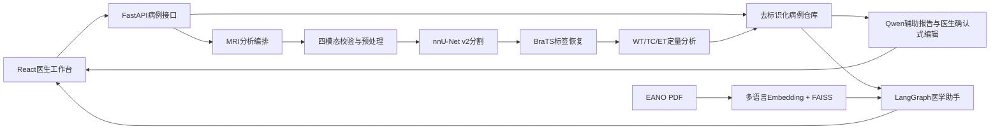

# 系统架构

## 关键设计

- 分割输出统一恢复到BraTS标签空间：背景0、非增强核心1、水肿2、增强肿瘤4。
- 前端显示采用ET紫、TC橙、WT青，图层和右侧切片定量数据同步变化。
- 数值由确定性代码生成，Qwen只负责受控文字总结和报告修改建议。
- 报告修改先生成建议，医生确认后才写入正式报告，并保留修订记录。
- RAG引用包含指南标题、版本和页码；当前Demo知识库使用EANO 2021指南。
- 所有输出强制标记需要专业医师审核，不输出疾病确诊或病理分级。

## 主要接口

| 接口 | 作用 |
| --- | --- |
| `POST /api/v1/upload` | 上传四模态NIfTI |
| `POST /api/v1/analyze` | 分割、标签恢复和定量分析 |
| `GET /api/v1/cases/{case_id}` | 恢复病例和已有产物 |
| `POST /api/v1/report` | 生成Qwen辅助报告 |
| `POST /api/v1/report/edit` | 生成非破坏性报告修改建议 |
| `POST /api/v1/report/apply` | 医生确认后保存报告修订 |
| `POST /api/v1/chat` | 病例总结或带引用的医学知识问答 |
